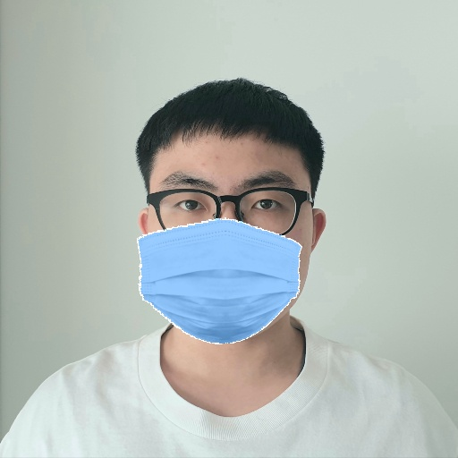

# WrongMaskTheFace - Convert face dataset to incorrectly masked dataset
## Acknowledgements

* This is my *quick-and-dirty* implementation of incorrectly masking faces based on [Aqeel Anwar](https://github.com/aqeelanwar)'s [**MaskTheFace**](https://github.com/aqeelanwar/MaskTheFace). Installation and basic usage follows the original methods from [**MaskTheFace**](https://github.com/aqeelanwar/MaskTheFace).

* The original [**MaskTheFace**](https://github.com/aqeelanwar/MaskTheFace) project is licensed under the MIT License - see the [LICENSE.md](LICENSE) file for details.

* If you find this repository useful, please check out the original [**MaskTheFace**](https://github.com/aqeelanwar/MaskTheFace) repository and use the following citation.

  ```
  @misc{anwar2020masked,
  title={Masked Face Recognition for Secure Authentication},
  author={Aqeel Anwar and Arijit Raychowdhury},
  year={2020},
  eprint={2008.11104},
  archivePrefix={arXiv},
  primaryClass={cs.CV}
  } 
  ```


## What is [MaskTheFace](https://github.com/aqeelanwar/MaskTheFace)?

[**MaskTheFace**](https://github.com/aqeelanwar/MaskTheFace) is computer vision-based script to mask faces in images. It uses a dlib based face landmarks detector to identify the face tilt and six key features of the face necessary for applying mask. Based on the face tilt, corresponding mask template is selected from the library of mask. The template mask is then transformed based on the six key features to fit perfectly on the face. (The rest of the original description is omitted. Check the original repository for full description.)


## What difference is made in WrongMaskTheFace?

I added `--wear_type` argument on `mask_the_face.py` and three modified functions on `utils/aux_functions.py`. The original project uses dlib based face landmarks detector to retrieve six key features. I made the modified functions to distort the six key features so the mask fits in an incorrect way.


## How to use new feature of WrongMaskTheFace

```
cd WrongMaskTheFace
# Generic
python mask_the_face.py --path <path-to-file-or-dir> --mask_type <type-of-mask> --wear_type <type-of-masking>

# Example
python mask_the_face.py --path 'data/office.jpg' --mask_type 'surgical' --wear_type chin_mask
```

### Arguments

| Argument  |                         Explanation                          |
| :-------: | :----------------------------------------------------------: |
| wear_type | Select the type of masking to be applied. <br/>Available options are 'normal'(default), 'chin_mask', 'nose_mask', 'eye_mask'. |

### Examples

<br/>

* picture of my face, normally masked, chin_masked, nose_masked, eye_masked face


## Frequently Asked Questions (FAQ)
Click [here](https://github.com/aqeelanwar/MaskTheFace/blob/master/faq.md) to troubleshoot errors faced while installing and running [**MaskTheFace**](https://github.com/aqeelanwar/MaskTheFace). This will connect to the `faq.md` file from original repository.


## Notes

[**MaskTheFace**](https://github.com/aqeelanwar/MaskTheFace) offers good applications of applying 5 different types of masks, applying custom colors and patterns on masks, masking multiple faces, adjusting angles and brightness, etc. The original project also offers the **MFR2** (Masked faces in real world for face recognition) **dataset**. Visit the original repository for full description of all usages and proper credit.